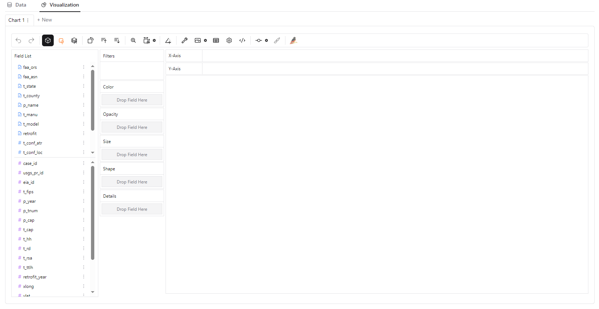
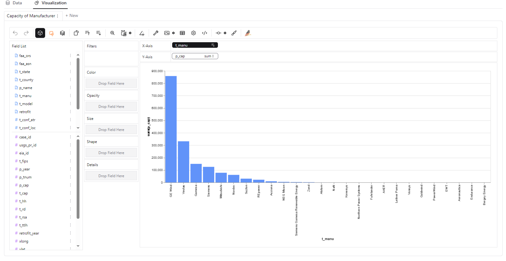
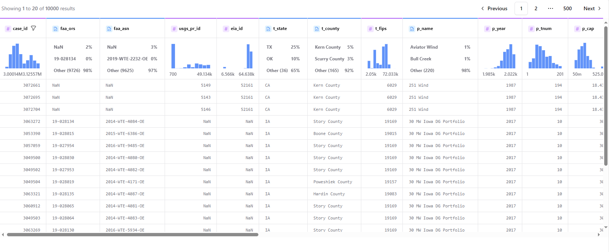
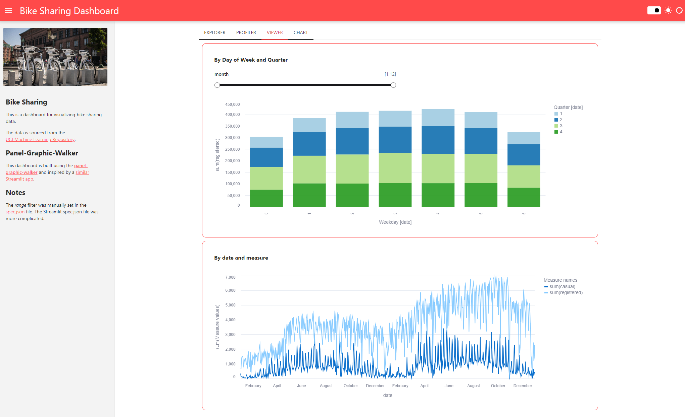
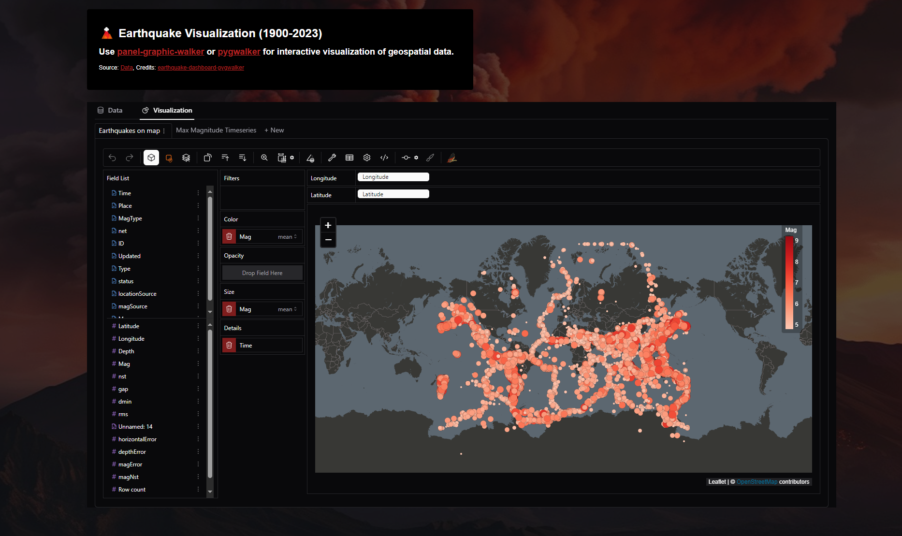

# ✨ Welcome to Panel Graphic Walker

[](https://opensource.org/licenses/MIT)
[](https://py.cafe/snippet/panel/v1#c=H4sIAB5hHGcAA42ST2_iMBDFvwryBSoFQ8JCIFIvu1rtnvewPZQKGTwQa4Pt2kNoivjuO86fUqRWVMkh8zx-b_xzTmxjJLCMqb01DntWaCl8j14rl_oiQlFreqm3zuwbZbU7iuIfuF7b9ssJm6vNQy0uqdVqDi8I2iujB3dBkdvePTlzB0KurHDPB8BBP0e0PhuNpEDhAT3PTWFK9cqN242OSks8uLXS4EdlfFXzYNGvna_CB3Ib9bx6VXq32tP57vseHeAmX60N5v077sGVYl1AMxWLmIPng3KwB42eaGyFx3a8JR2lPm77QXjepOGuSR02IIJOXljZQLTuoFJY-1fBkWVbUXiIGEiFP3VIZxm6Aym2wtzosKUyUkkYlmOezHhMmwtRmQOy7MRKcIEjyxKa1hj8Y8jy1IU5qiK2yVUhHVDT49sKijUxpcWjkpizLJ6OI7ZX-qEpJ031G9Qup5xQKhkIqAK-kyuR-mE0CsLtPkkIrcN100stVgRfxs5P5-iDKdqg2ZzPJkk6TtP0W7qYLyafTn-xJJLcVuza9rL8_g45vuD1BA2hLj6exHwyS5NFkiTTZByP5zfo3SbWErhFqwP1MZ68my-dfiUTwZEsiluhXV9IDc85qm-NfvXHp_N_IeI7ygQEAAA)

**A simple way to explore your data through a *[Tableau-like](https://www.tableau.com/)* interface directly in your [Panel](https://panel.holoviz.org/) data applications.**


## What is Panel Graphic Walker?

`panel-graphic-walker` brings the power of [Graphic Walker](https://github.com/Kanaries/graphic-walker) to your data science workflow, seamlessly integrating interactive data exploration into notebooks and [Panel](https://panel.holoviz.org/) applications. Effortlessly create dynamic visualizations, analyze datasets, and build dashboards—all within a Pythonic, intuitive interface.

## Why choose Panel Graphic Walker?

- **Simplicity:** Just plug in your data, and `panel-graphic-walker` takes care of the rest.
- **Quick Data Exploration:** Start exploring in seconds, with instant chart and table rendering via a *[Tableau-like](https://www.tableau.com/)* interface.
- **Integrates with Python Visualization Ecosystem:** Easily integrates with [Panel](https://panel.holoviz.org/index.html), [HoloViz](https://holoviz.org/), and the broader [Python Visualization](https://pyviz.org/tools.html) ecosystem.
- **Scales to your Data:** Designed for diverse data backends and scalable, so you can explore even larger datasets seamlessly. *(More Features Coming Soon)*

## Pin your version!

This project is **in early stages**, so if you find a version that suits your needs, it’s recommended to **pin your version**, as updates may introduce changes.

## Installation

Install `panel-graphic-walker` via `pip`:

```bash
pip install panel-graphic-walker
```

## Usage

### Basic Graphic Walker Pane

[](https://py.cafe/snippet/panel/v1#code=https%3A//raw.githubusercontent.com/panel-extensions/panel-graphic-walker/refs/heads/main/examples/examples/reference/basic.py&requirements=panel-graphic-walker%3E%3D0.4.0) [](https://github.com/panel-extensions/panel-graphic-walker/blob/main/examples/examples/reference/basic.py)

Here’s an example of how to create a simple `GraphicWalker` pane:

```python
import pandas as pd
import panel as pn

from panel_gwalker import GraphicWalker

pn.extension()

df = pd.read_csv("https://datasets.holoviz.org/windturbines/v1/windturbines.csv.gz", nrows=10000)

GraphicWalker(df).servable()
```

You can put the code in a file `app.py` and serve it with `panel serve app.py`.



### Setting the Chart Specification

[](https://py.cafe/snippet/panel/v1#code=https%3A//raw.githubusercontent.com/panel-extensions/panel-graphic-walker/refs/heads/main/examples/examples/reference/spec.py&requirements=panel-graphic-walker%3E%3D0.4.0) [](https://github.com/panel-extensions/panel-graphic-walker/blob/main/examples/examples/reference/spec.py)

In the `GraphicWalker` UI, you can save your chart specification as a json file. You can then open the `GraphicWalker` with the same `spec`:

```python
GraphicWalker(df, spec="spec.json")
```



### Changing the renderer

[](https://py.cafe/snippet/panel/v1#code=https%3A//raw.githubusercontent.com/panel-extensions/panel-graphic-walker/refs/heads/main/examples/examples/reference/renderer.py&requirements=panel-graphic-walker%3E%3D0.4.0) [](https://github.com/panel-extensions/panel-graphic-walker/blob/main/examples/examples/reference/renderer.py)

You may change the `renderer` to one of 'explorer' (default), 'profiler', 'viewer' or 'chart':

```python
GraphicWalker(df, renderer='profiler')
```



### Scale with Server-Side Computation

[](https://py.cafe/snippet/panel/v1#code=https%3A//raw.githubusercontent.com/panel-extensions/panel-graphic-walker/refs/heads/main/examples/examples/reference/server_computation.py&requirements=panel-graphic-walker%5Bserver%5D%3E%3D0.4.0) [](https://github.com/panel-extensions/panel-graphic-walker/blob/main/examples/examples/reference/server_computation.py)

In some environments you may meet message or client side data limits. To handle larger datasets, you can offload the *computation* to the *server*.

First you will need to install extra dependencies:

```bash
pip install panel-graphic-walker[server]
```

Then you can use server side computation with `server_computation=True`:

```python
walker = GraphicWalker(df, server_computation=True)
```

This setup allows your application to manage larger datasets efficiently by leveraging server resources for data processing.

Please note that if running on Pyodide the computations will always take place on the client.

### Explore all the Parameters and Methods

[](https://py.cafe/snippet/panel/v1#code=https%3A//raw.githubusercontent.com/panel-extensions/panel-graphic-walker/refs/heads/main/examples/examples/reference_app/app.py&requirements=panel-graphic-walker%3E%3D0.4.0%0Afastparquet) [](https://github.com/panel-extensions/panel-graphic-walker/blob/main/examples/examples/reference_app/app.py)

To learn more about all the parameters and methods of `GraphicWalker` try the `panel-graphic-walker` Reference App.

[(https://py.cafe/badge.svg)](https://py.cafe/snippet/panel/v1#code=https%3A//raw.githubusercontent.com/panel-extensions/panel-graphic-walker/refs/heads/main/examples/examples/reference_app/app.py&requirements=panel-graphic-walker%3E%3D0.4.0%0Afastparquet)

## Examples

### Bike Sharing Dashboard

[](https://py.cafe/snippet/panel/v1#code=https%3A//raw.githubusercontent.com/panel-extensions/panel-graphic-walker/refs/heads/main/examples/examples/bikesharing_dashboard/app.py&requirements=panel-graphic-walker%5Bserver%5D%3E%3D0.4.0) [](https://github.com/panel-extensions/panel-graphic-walker/blob/main/examples/examples/bikesharing_dashboard/app.py)



### Earthquake Dashboard

[](https://py.cafe/snippet/panel/v1#code=https%3A//raw.githubusercontent.com/panel-extensions/panel-graphic-walker/refs/heads/main/examples/examples/earthquake_dashboard/app.py&requirements=panel-graphic-walker%5Bserver%5D%3E%3D0.4.0) [](https://github.com/panel-extensions/panel-graphic-walker/blob/main/examples/examples/earthquake_dashboard/app.py)



## API

### Parameters

#### Core

- `object` (DataFrame): The data for exploration. Please note that if you update the `object`, then the existing chart(s) will not be deleted and you will have to create a new one manually to use the new dataset.
- `fields` (list): Optional specification of fields (columns).
- `spec` (str, dict, list): Optional chart specification as url, json, dict or list. Can be generated via the `export` method.
- `server_computation` (bool): Optional. If True the computations will take place on the Panel server or in the Jupyter kernel instead of the client to scale to larger datasets. Default is False.
- `renderer` (str): How to display the data. One of 'explorer' (default), 'profiler', 'viewer' or 'chart'. These correspond to `GraphicWalker`, `TableWalker`, `GraphicRenderer` and `PureRender` in `graphic-walker` React library.
- `page_size` (int): The number of rows per page in the table. Only applicable for the `profiler` renderer.
- `index` (int | list): Optional index or indices to display. Default is None (all). Only applicable for the `viewer` or `chart` renderer.
- `tab` ('data' | 'vis'): Set the active tab to 'data' or 'vis' (default). Only applicable for the `explorer` renderer. Not bi-directionally synced.
- `container_height` (str): The height of a single chart in the `viewer` or `chart` renderer. For example '500px' (pixels) or '30vh' (viewport height).

#### Style

- `appearance` (str): Optional dark mode preference: 'light', 'dark' or 'media'. If not provided the appearance is derived from `pn.config.theme`.
- `theme_key` (str): Optional chart theme: 'g2' (default), 'streamlit' or 'vega'. If using the [`FastListTemplate`](https://panel.holoviz.org/reference/templates/FastListTemplate.html) try combining the `theme_key` 'g2' with the `accent` color <div style="display:inline;background-color:#5B8FF9;color:white;padding:0 5px;border-radius:3px;">#5B8FF9</div>. Or 'streamlit' and <div style="display:inline;background-color:#ff4a4a;color:white;padding:0 5px;border-radius:3px;">#ff4a4a</div>. Or 'vega' and <div style="display:inline;background-color:#4c78a8;color:white;padding:0 5px;border-radius:3px;">#4c78a8</div>.

#### Export and Save

- `export_mode` ('spec' | 'svg'): Used as default by `export` and `save`. Default is 'spec'.
- `export_scope` ('all' | 'current'): Used as default scope for `export` and `save`.
- `export_timeout` (int): Exports timeout in milliseconds. Used as default for `export` and `save`.
- `export` (action): Export the chart(s) as either a spec or SVG.
- `save_path` (str | PathLike): Used as default path for save. Default is 'tmp_graphic_walker.json'.
- `save` (action): Saves the chart(s) as either a spec or SVG.

#### Other

- `config` (dict): Optional additional configuration for Graphic Walker. See the [Graphic Walker API](https://github.com/Kanaries/graphic-walker#api) for more details.

### Methods

#### Clone

- `clone`: Clones the `GraphicWalker`. Takes additional keyword arguments. Example: `walker.clone(renderer='profiler', index=1)`.
- `chart`: Clones the `GraphicWalker` and sets `renderer='chart'`. Example: `walker.chart(0)`.
- `explorer`: Clones the `GraphicWalker` and sets `renderer='explorer'`.Example: `walker.explorer(width=400)`.
- `profiler`: Clones the `GraphicWalker` and sets `renderer='profiler'`.Example: `walker.profiler(width=400)`.
- `viewer`: Clones the `GraphicWalker` and sets `renderer='viewer'`. Example: `walker.viewer(width=400)`.

#### Export and Save Methods

- `export`: Returns chart(s) from the frontend exported either as Vega specifications or as SVG strings. Uses the `export_mode`, `export_scope` or `export_timeout` values as defaults if `None` is provided as argument.
- `save`: Saves chart(s) from the frontend exported either as Vega specifications or as SVG strings.Uses the `save_path`, `export_mode`, `export_scope` or `export_timeout` values as defaults if `None` is provided as argument.
- `create_export_settings`: Returns a UI component to set the `export_scope`, `export_mode` and `export_timeout` parameters.
- `create_export_button`: Returns a UI component to export the chart(s) as either a spec or SVG.
The `value` parameter will hold the exported spec.
- `create_save_button`: Returns a UI component to save the chart(s) as either a spec or SVG. Will save to `save_path` path.

#### Other Methods

- `calculated_fields`: Returns a list of `fields` calculated from the `object`. This is a
great starting point if you want to provide custom `fields`.

## Vision

Our dream is that this package is super simple to use and supports your use cases:

- Great documentation including examples.
- Supports your preferred data backend including Pandas, Polars and DuckDB.
- Supports persisting and reusing Graphic Walker specifications.
- Scales to even the largest datasets only limited by your server, cluster or database.

## ❤️ Contributions

Contributions and co-maintainers are very welcome! Please submit issues or pull requests to the [GitHub repository](https://github.com/panel-extensions/panel-graphic-walker). Check out the [DEVELOPER_GUIDE](DEVELOPER_GUIDE.md) for more information.
